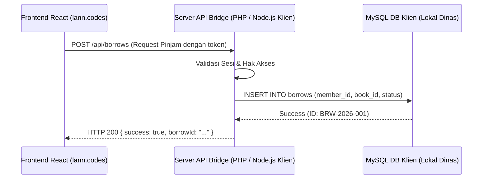

# 📘 PANDUAN MIGRASI DATABASE KUSTOM
### (Transisi Layanan Supabase/PostgreSQL ke MySQL, CSV, API, & Hosting Umum)

Panduan teknis ini disusun khusus untuk membantu pengembang, administrator, maupun klien yang ingin memindahkan atau mengadaptasi sistem website **Disipusda** dari infrastruktur cloud **Supabase (PostgreSQL)** ke basis data relasional **MySQL tradisional** di lingkungan hosting umum (seperti cPanel, VPS, atau Server Instansi Lokal).

---

## 📂 Daftar Isi
1. [Perbandingan Paradigma: PostgreSQL (Supabase) vs MySQL](#1-perbandingan-paradigma-postgresql-supabase-vs-mysql)
2. [Perbandingan Fitur Sistem: Web Baru vs Web Lama](#2-perbandingan-fitur-sistem-web-baru-vs-web-lama)
3. [Tiga Opsi Migrasi Basis Data](#3-tiga-opsi-migrasi-basis-data)
   - [Opsi A: Ekspor/Impor CSV Manual](#opsi-a-eksporimpor-csv-manual)
   - [Opsi B: Sinkronisasi Jembatan API (API Bridge)](#opsi-b-sinkronisasi-jembatan-api-api-bridge)
   - [Opsi C: Migrasi Penuh ke Skema MySQL Kustom (DDL SQL)](#opsi-c-migrasi-penuh-ke-skema-mysql-kustom-ddl-sql)
4. [Alternatif Penyimpanan File Gambar (Object Storage/Bucket)](#4-alternatif-penyimpanan-file-gambar-object-storagebucket)
5. [Konfigurasi SMTP Transaksional di Hosting Umum](#5-konfigurasi-smtp-transaksional-di-hosting-umum)
6. [Daftar Referensi Variabel Layanan Kode Frontend ("Daftar Nomor Telepon")](#6-daftar-referensi-variabel-layanan-kode-frontend-daftar-nomor-telepon)

---

## 1. Perbandingan Paradigma: PostgreSQL (Supabase) vs MySQL

Sebelum memulai migrasi, Anda harus memahami beberapa perbedaan fundamental antara postgresql yang digunakan Supabase dengan server MySQL biasa:

| Aspek Teknis | Supabase (PostgreSQL) | MySQL Tradisional | Solusi Transisi / Migrasi |
|---|---|---|---|
| **Format ID (Primary Key)** | Menggunakan tipe data `UUID` secara acak. | Umumnya menggunakan integer `Auto-Increment` (`INT`). | Ubah tipe data kolom kunci utama di MySQL menjadi `VARCHAR(36)` atau `VARCHAR(255)` agar nilai UUID Supabase tetap dapat disimpan sebagai string tanpa merusak kode frontend. |
| **Keamanan Data (RLS)** | Kebijakan **Row-Level Security (RLS)** bawaan SQL mengontrol siapa yang bisa membaca/menulis baris tertentu. | Tidak mendukung RLS bawaan di tingkat basis data. | Keamanan data harus dipindahkan ke tingkat aplikasi (backend server API/middleware) untuk memastikan pengguna hanya bisa mengakses data mereka sendiri. |
| **Data Terstruktur Kompleks** | Mendukung tipe data `JSONB` yang efisien dan dapat diindeks. | Mendukung tipe data `JSON` (pada MySQL 5.7+) atau disimpan sebagai `TEXT`. | Konversikan nilai JSONB Supabase menjadi format string teks JSON mentah atau kolom terpisah di MySQL. |
| **Zona Waktu (Timezone)** | Menggunakan `TIMESTAMPTZ` yang menyimpan offset zona waktu secara akurat. | Menggunakan `TIMESTAMP` atau `DATETIME` tanpa timezone default yang melekat. | Gunakan tipe data `DATETIME` di MySQL dan simpan semua waktu dalam standar UTC, lalu konversikan di sisi klien sesuai GMT+7. |
| **Pemicu (Triggers)** | Memiliki bahasa prosedural `PL/pgSQL` yang sangat fleksibel. | Memiliki trigger internal dengan sintaks SQL prosedural MySQL. | Tulis ulang trigger audit dan update timestamp menggunakan dialek MySQL atau handle modifikasi kolom `updated_at` di tingkat kode server. |

---

## 2. Perbandingan Fitur Sistem: Web Baru vs Web Lama

Apabila klien membandingkan sistem baru ini dengan website dinas lama mereka, berikut adalah fitur-fitur baru yang sebelumnya **tidak ada** di web lama namun kini menjadi pilar utama sistem perpustakaan digital:

### 🌟 Fitur Baru yang TIDAK ADA di Web Lama:
1. **Katalog Buku & Pencarian Pintar**: Sistem pencarian, filter kategori, dan status ketersediaan stok buku secara langsung (*real-time*).
2. **Sirkulasi Buku Mandiri**: Tombol "Pinjam Buku" langsung dari halaman detail buku untuk memesan antrian pengambilan secara mandiri.
3. **Sistem Antrian (*Queueing System*)**: Pengguna dapat masuk ke daftar tunggu jika stok buku kosong, dan otomatis naik antrian saat buku dikembalikan oleh admin.
4. **Keanggotaan Mandiri (*Member Authentication*)**: Layanan daftar dan masuk anggota menggunakan email (OTP) serta integrasi sekali klik Google Sign-In.
5. **Panel Admin Khusus Sirkulasi**: Halaman kelola antrian, konfirmasi peminjaman, pencatatan pengembalian buku, dan pelacakan denda keterlambatan.
6. **Notifikasi Email Otomatis (Cron Job)**: Pengingat email otomatis kepada peminjam saat batas waktu pengambilan hampir habis (6 jam sebelum kedaluwarsa) dan denda harian keterlambatan.
7. **Sistem Log Audit & Pelaporan Warga**: Perekaman riwayat modifikasi artikel admin untuk meminimalisir kesalahan operasional, serta form pengaduan terintegrasi.

---

## 3. Tiga Opsi Migrasi Basis Data

Klien Anda memiliki tiga opsi arsitektur utama untuk memindahkan atau menyambungkan basis data perpustakaan digital:

### Opsi A: Ekspor/Impor CSV Manual
Sangat direkomendasikan untuk pemindahan data awal (migrasi satu kali) pada tabel katalog buku (`books`), kategori (`categories`), dan artikel berita (`articles`).

#### Langkah-langkah:
1. **Ekspor dari Supabase**:
   * Buka **Supabase Dashboard** > **Table Editor**.
   * Pilih tabel `books`, lalu klik tombol **Export to CSV** di pojok kanan atas.
   * Lakukan hal yang sama untuk tabel `categories` dan `articles`.
2. **Modifikasi Struktur Berkas CSV (Opsional)**:
   * Buka berkas CSV di Microsoft Excel atau Google Sheets.
   * Pastikan kolom tanggal seperti `created_at` berformat standar MySQL (`YYYY-MM-DD HH:MM:SS`).
3. **Impor ke MySQL (phpMyAdmin)**:
   * Masuk ke **phpMyAdmin** hosting baru Anda.
   * Pilih tabel tujuan (misal: `books`).
   * Masuk ke tab **Import** (Impor).
   * Pilih berkas CSV, atur format pemisah menjadi koma (`,`), lalu klik **Import**.

---

### Opsi B: Sinkronisasi Jembatan API (API Bridge)
Jika instansi perpustakaan ingin mempertahankan database pusat mereka sendiri dan menggunakan website ini sebagai antarmuka (frontend) saja, Anda bisa membangun program jembatan API (*Bridge API*) sederhana.

#### Alur Kerja API Bridge:


#### Struktur JSON Standard untuk Sinkronisasi Katalog Buku:
```json
{
  "action": "sync_book",
  "payload": {
    "id": "c7a8b9f0-d1e2-3f4g-5h6i-7j8k9l0m1n2o",
    "judul": "Perahu Kertas",
    "penulis": "Dee Lestari",
    "penerbit": "Bentang Pustaka",
    "tahunTerbit": 2009,
    "stok": 5,
    "rak": "A-3",
    "sampulUrl": "https://hostanda.com/uploads/perahu_kertas.jpg"
  }
}
```

---

### Opsi C: Migrasi Penuh ke Skema MySQL Kustom (DDL SQL)
Jika Anda memutuskan untuk menulis ulang backend menggunakan PHP, Node.js, atau Go dengan MySQL murni, gunakan struktur tabel DDL berikut yang setara dengan skema keamanan Supabase yang baru:

```sql
-- ============================================================================
-- SKEMA BASIS DATA MYSQL KUSTOM (SETARA DENGAN SKEMA SECURITY SUPABASE)
-- ============================================================================

CREATE DATABASE IF NOT EXISTS `disipusda_library` CHARACTER SET utf8mb4 COLLATE utf8mb4_unicode_ci;
USE `disipusda_library`;

-- 1. TABEL ADMIN
CREATE TABLE IF NOT EXISTS `admins` (
  `id` VARCHAR(100) NOT NULL,
  `email` VARCHAR(191) NOT NULL,
  `nama` VARCHAR(100) NOT NULL,
  `role` ENUM('admin', 'super_admin') NOT NULL DEFAULT 'admin',
  `created_at` DATETIME DEFAULT CURRENT_TIMESTAMP,
  `updated_at` DATETIME DEFAULT CURRENT_TIMESTAMP ON UPDATE CURRENT_TIMESTAMP,
  PRIMARY KEY (`id`),
  UNIQUE KEY `uq_admin_email` (`email`)
) ENGINE=InnoDB;

-- 2. TABEL ANGGOTA PERPUSTAKAAN (MEMBERS)
CREATE TABLE IF NOT EXISTS `members` (
  `id` VARCHAR(100) NOT NULL,
  `nik` VARCHAR(50) DEFAULT NULL,
  `nama` VARCHAR(100) NOT NULL,
  `email` VARCHAR(191) NOT NULL,
  `telepon` VARCHAR(20) DEFAULT NULL,
  `alamat` TEXT DEFAULT NULL,
  `created_at` DATETIME DEFAULT CURRENT_TIMESTAMP,
  `updated_at` DATETIME DEFAULT CURRENT_TIMESTAMP ON UPDATE CURRENT_TIMESTAMP,
  PRIMARY KEY (`id`),
  UNIQUE KEY `uq_member_email` (`email`)
) ENGINE=InnoDB;

-- 3. TABEL KATEGORI BUKU & ARTIKEL
CREATE TABLE IF NOT EXISTS `categories` (
  `id` BIGINT UNSIGNED AUTO_INCREMENT PRIMARY KEY,
  `type` VARCHAR(50) NOT NULL COMMENT 'book atau article',
  `name` VARCHAR(100) NOT NULL,
  `slug` VARCHAR(100) NOT NULL,
  UNIQUE KEY `uq_categories_type_slug` (`type`, `slug`)
) ENGINE=InnoDB;

-- 4. TABEL KATALOG BUKU
CREATE TABLE IF NOT EXISTS `books` (
  `id` VARCHAR(100) NOT NULL,
  `judul` VARCHAR(255) NOT NULL,
  `penulis` VARCHAR(255) NOT NULL,
  `penerbit` VARCHAR(255) NOT NULL,
  `sinopsis` TEXT DEFAULT NULL,
  `stok` INT NOT NULL DEFAULT 0,
  `rak` VARCHAR(50) DEFAULT NULL,
  `sampulUrl` VARCHAR(2048) DEFAULT NULL,
  `rating` DECIMAL(3,2) NOT NULL DEFAULT 0.00,
  `created_at` DATETIME DEFAULT CURRENT_TIMESTAMP,
  `updated_at` DATETIME DEFAULT CURRENT_TIMESTAMP ON UPDATE CURRENT_TIMESTAMP,
  PRIMARY KEY (`id`)
) ENGINE=InnoDB;

-- 5. TABEL TRANSAKSI PEMINJAMAN (BORROWS)
CREATE TABLE IF NOT EXISTS `borrows` (
  `id` VARCHAR(100) NOT NULL,
  `memberId` VARCHAR(100) NOT NULL,
  `bookId` VARCHAR(100) NOT NULL,
  `status` ENUM('menunggu_diambil', 'dipinjam', 'kembali', 'batal') NOT NULL DEFAULT 'menunggu_diambil',
  `tanggalPinjam` VARCHAR(100) NOT NULL,
  `batasAmbil` VARCHAR(100) NOT NULL,
  `tanggalKembali` VARCHAR(100) DEFAULT NULL,
  `created_at` DATETIME DEFAULT CURRENT_TIMESTAMP,
  `updated_at` DATETIME DEFAULT CURRENT_TIMESTAMP ON UPDATE CURRENT_TIMESTAMP,
  PRIMARY KEY (`id`),
  KEY `idx_borrow_member` (`memberId`),
  KEY `idx_borrow_book` (`bookId`),
  CONSTRAINT `fk_borrows_member` FOREIGN KEY (`memberId`) REFERENCES `members` (`id`) ON DELETE CASCADE,
  CONSTRAINT `fk_borrows_book` FOREIGN KEY (`bookId`) REFERENCES `books` (`id`) ON DELETE CASCADE
) ENGINE=InnoDB;

-- 6. TABEL ANTRIAN BUKU (QUEUE)
CREATE TABLE IF NOT EXISTS `queue` (
  `id` VARCHAR(100) NOT NULL,
  `bookId` VARCHAR(100) NOT NULL,
  `memberId` VARCHAR(100) NOT NULL,
  `queuePosition` INT NOT NULL,
  `created_at` DATETIME DEFAULT CURRENT_TIMESTAMP,
  PRIMARY KEY (`id`),
  KEY `idx_queue_book` (`bookId`),
  CONSTRAINT `fk_queue_book` FOREIGN KEY (`bookId`) REFERENCES `books` (`id`) ON DELETE CASCADE,
  CONSTRAINT `fk_queue_member` FOREIGN KEY (`memberId`) REFERENCES `members` (`id`) ON DELETE CASCADE
) ENGINE=InnoDB;

-- 7. TABEL LAPOR WARGA (WARGA REPORTS)
CREATE TABLE IF NOT EXISTS `warga_reports` (
  `id` VARCHAR(100) NOT NULL,
  `nama` VARCHAR(100) NOT NULL,
  `email` VARCHAR(191) NOT NULL,
  `telepon` VARCHAR(20) NOT NULL,
  `kategori` VARCHAR(100) NOT NULL,
  `pesan` TEXT NOT NULL,
  `alamat` TEXT NOT NULL,
  `tanggal` VARCHAR(100) NOT NULL,
  `status` VARCHAR(50) NOT NULL DEFAULT 'Baru',
  `created_at` DATETIME DEFAULT CURRENT_TIMESTAMP,
  PRIMARY KEY (`id`)
) ENGINE=InnoDB;

-- 8. TABEL LOG NOTIFIKASI EMAIL
CREATE TABLE IF NOT EXISTS `borrow_notification_logs` (
  `id` BIGINT UNSIGNED AUTO_INCREMENT PRIMARY KEY,
  `borrow_id` VARCHAR(100) NOT NULL,
  `member_id` VARCHAR(100) NOT NULL,
  `notification_type` ENUM('pickup_6h', 'due_h2', 'overdue_daily') NOT NULL,
  `notification_date` DATE NOT NULL,
  `reason` TEXT DEFAULT NULL,
  `sent_at` DATETIME DEFAULT CURRENT_TIMESTAMP,
  UNIQUE KEY `uq_notif_once_per_day` (`borrow_id`, `notification_type`, `notification_date`)
) ENGINE=InnoDB;
```

---

## 4. Alternatif Penyimpanan File Gambar (Object Storage/Bucket)

Secara bawaan, program menggunakan **Supabase Storage Bucket** untuk menyimpan file unggahan admin seperti gambar sampul buku dan ilustrasi berita artikel. Jika beralih dari Supabase, Anda wajib menggunakan alternatif penyimpanan berikut:

### Opsi A: FTP/Local Hosting Disk (Solusi Sederhana & Gratis)
Gunakan ruang penyimpanan lokal pada server web hosting Anda sendiri.
* **Metode**: File diunggah langsung ke folder proyek publik (misal: `public/uploads/`).
* **Implementasi**: Ganti fungsi unggah di `src/services/imageUtils.ts` untuk mengirim berkas via request HTTP `multipart/form-data` ke backend PHP/Node.js Anda, yang kemudian akan memindahkan file ke folder tujuan menggunakan fungsi bawaan server (seperti `move_uploaded_file()` di PHP).

### Opsi B: Cloudflare R2 / AWS S3 (Solusi Skala Besar & Sangat Murah)
Penyimpanan awan terdistribusi yang kompatibel dengan protokol AWS S3.
* **Keuntungan**: Sangat murah (Cloudflare R2 memberikan kuota gratis 10 GB/bulan).
* **Penyuntingan Kode**: Anda hanya perlu mengganti pustaka klien `@supabase/storage-js` di `src/services/storageService.ts` dengan pustaka resmi `@aws-sdk/client-s3` untuk mengarah ke endpoint CDN kustom Anda.

---

## 5. Konfigurasi SMTP Transaksional di Hosting Umum

Jika Anda bermigrasi ke cPanel/Shared Hosting, Anda tidak perlu lagi menggunakan API berbayar seperti Resend.com. Anda dapat memanfaatkan fitur **Email Accounts** bawaan cPanel:

### Cara Konfigurasi Mail Server cPanel:
1. Masuk ke **cPanel Dashboard** > **Email Accounts** > klik **+ Create**.
2. Buat akun email baru (misal: `perpustakaan@domainanda.com`).
3. Setelah dibuat, klik **Connect Devices** untuk melihat konfigurasi SMTP detail.
4. Salin data kredensial berikut:
   * **Outgoing Mail Server (SMTP Host)**: Biasanya `mail.domainanda.com`.
   * **SMTP Port**: `465` (pilih SSL/TLS aman) atau `587` (STARTTLS).
5. Pasang kredensial di konfigurasi lingkungan web backend Anda agar email transaksional konfirmasi peminjaman buku dapat terkirim lancar tanpa hambatan ke email anggota.

---

## 6. Daftar Referensi Variabel Layanan Kode Frontend ("Daftar Nomor Telepon")

Apabila di masa mendatang Anda ingin menyesuaikan nama database, memindahkan API key, atau mengalihkan tabel-tabel di atas karena adanya perubahan backend, **berikut adalah peta jalan berkas service penting di folder frontend yang wajib Anda ubah**:

### 🗺️ Peta Jalan Berkas & Referensi Variabel:

#### 1) `src/services/supabase.ts`
* **Peran**: Gerbang inisialisasi awal koneksi Supabase Client.
* **Variabel Kunci**:
  * `supabaseUrl` (mengambil dari `import.meta.env.VITE_SUPABASE_URL`)
  * `supabaseAnonKey` (mengambil dari `import.meta.env.VITE_SUPABASE_ANON_KEY`)
* **Saat Migrasi**: Jika beralih penuh ke server backend buatan sendiri (MySQL API), file ini bisa dihapus dan diganti dengan inisialisasi Fetch/Axios API client standar.

#### 2) `src/services/bookService.ts`
* **Peran**: Otak sirkulasi peminjaman, wishlist, stok buku, rating, antrian buku, dan sinkronisasi lokal.
* **Referensi Tabel**:
  * `.from('books')` — Akses tabel katalog buku.
  * `.from('borrows')` — Akses transaksi peminjaman.
  * `.from('queue')` — Akses antrian buku.
* **Saat Migrasi**: Sesuaikan nama-nama tabel di dalam fungsi string `.from('nama_tabel')` apabila nama tabel di MySQL Anda berbeda dari default.

#### 3) `src/services/dataService.ts`
* **Peran**: Mengelola artikel, berita, dan kategori konten.
* **Referensi Tabel**:
  * `.from('articles')` — Membaca dan memodifikasi artikel berita.
  * `.from('categories')` — Mengambil data filter kategori.
* **Saat Migrasi**: Ganti query `.select('*')` dengan pemanggilan endpoint API backend Anda (seperti `fetch('/api/articles')`).

#### 4) `src/services/supabaseAuthService.ts`
* **Peran**: Menangani registrasi anggota, login OTP, integrasi Google OAuth, dan verifikasi profil anggota.
* **Referensi Tabel**:
  * `.from('members')` — Sinkronisasi biodata profil anggota dari otentikasi Google/OTP.
* **Saat Migrasi**: Jika auth dipindahkan ke MySQL, fungsi `signInWithOAuth` Google harus diarahkan ke endpoint backend baru Anda yang menangani callback Google OAuth.

#### 5) `src/services/storageService.ts`
* **Peran**: Helper untuk unggah dan hapus berkas gambar sampul/artikel di bucket.
* **Nama Bucket Utama**: `'book-covers'` dan `'article-images'`.
* **Saat Migrasi**: Fungsi `uploadFile` dan `deleteFile` wajib dimodifikasi total agar mengarah ke API upload server PHP/Node.js lokal Anda.

---
*Dokumen panduan ini dirancang untuk memastikan klien memiliki fleksibilitas penuh di masa depan jika ingin beralih dari layanan Supabase ke MySQL tanpa kehilangan fungsionalitas sistem perpustakaan.*
