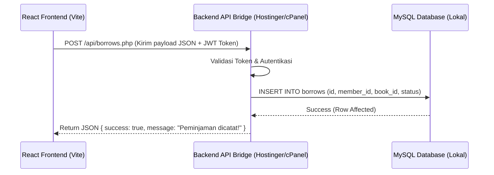

# 📘 PANDUAN KOMPREHENSIF MIGRASI DATABASE KUSTOM
### (Transisi Layanan Supabase/PostgreSQL ke MySQL, CSV, API, & Hosting Umum)

Panduan teknis ini disusun khusus sebagai acuan utama bagi pengembang, administrator basis data, maupun tim IT dalam memindahkan, mengadaptasi, dan mengoperasikan sistem website **Disipusda** dari infrastruktur cloud **Supabase (PostgreSQL)** ke basis data relasional **MySQL tradisional** di lingkungan hosting umum (seperti cPanel, VPS, Hostinger, atau server dinas lokal).

---

## 📂 Daftar Isi
1. [Perbandingan Paradigma Fundamental: PostgreSQL vs MySQL](#1-perbandingan-paradigma-fundamental-postgresql-vs-mysql)
2. [Pemetaan Tipe Data & Kompatibilitas Sistem](#2-pemetaan-tipe-data--kompatibilitas-sistem)
3. [Opsi Migrasi A: Ekspor/Impor CSV Secara Manual (phpMyAdmin)](#3-opsi-migrasi-a-eksporimpor-csv-secara-manual-phpmyadmin)
4. [Opsi Migrasi B: Arsitektur API Bridge (Jembatan Sinkronisasi API)](#4-opsi-migrasi-b-arsitektur-api-bridge-jembatan-sinkronisasi-api)
5. [Opsi Migrasi C: DDL Skema MySQL Lengkap (Produksi Siap Pakai)](#5-opsi-migrasi-c-ddl-skema-mysql-lengkap-produksi-siap-pakai)
6. [Skrip Backend Jembatan (PHP & Node.js Express Mandiri)](#6-skrip-backend-jembatan-php--nodejs-express-mandiri)
7. [Penanganan Gambar & Berkas (Storage Transition)](#7-penanganan-gambar--berkas-storage-transition)

---

## 1. Perbandingan Paradigma Fundamental: PostgreSQL vs MySQL

Sebelum memulai migrasi, Anda wajib memahami perbedaan arsitektur di bawah ini agar tidak terjadi kesalahan logika saat query database dijalankan:

| Fitur / Karakteristik | Supabase (PostgreSQL) | MySQL (cPanel / Hosting Umum) | Solusi Transisi / Migrasi |
| :--- | :--- | :--- | :--- |
| **UUID (Universally Unique ID)** | Didukung secara natif (`uuid`). Nilai acak 36 karakter. | Tipe data `UUID` tidak didukung secara natif (sebelum MySQL 8.0). | Gunakan tipe `VARCHAR(36)` di MySQL. Ini aman karena UUID dapat disimpan sebagai string. |
| **Row Level Security (RLS)** | Keamanan baris data dikontrol di tingkat DB lewat SQL Policies. | Tidak mendukung RLS di tingkat database. | Pindahkan validasi otorisasi penuh ke tingkat aplikasi backend (skrip PHP/Node.js). |
| **Data Dokumen JSON** | Tipe data `JSONB` yang mendukung indexing b-tree cepat. | Tipe `JSON` (MySQL 5.7.8+) atau fallback ke tipe `TEXT`. | Gunakan kolom `TEXT` di MySQL, dan parse string JSON menjadi object di backend. |
| **Timestamp & Zona Waktu** | Tipe `TIMESTAMPTZ` yang menyimpan zona waktu akurat (UTC). | Tipe `DATETIME` atau `TIMESTAMP` lokal. | Simpan data waktu dalam format UTC atau set database timezone secara global ke GMT+7 (`SET time_zone = '+07:00'`). |
| **Bahasa Pemrograman DB** | Prosedur tersimpan menggunakan `PL/pgSQL`. | Prosedur tersimpan menggunakan standard `SQL/PSM`. | Tulis ulang fungsi/prosedur database (seperti RPC) menjadi query native di backend. |

---

## 2. Pemetaan Tipe Data & Kompatibilitas Sistem

Gunakan pemetaan (mapping) tipe data berikut saat mengkonversi struktur tabel dari PostgreSQL ke MySQL:

- **`UUID`** ➡️ **`VARCHAR(36)`**
- **`TIMESTAMPTZ`** ➡️ **`DATETIME`** (atau `TIMESTAMP` dengan default `CURRENT_TIMESTAMP`)
- **`TEXT`** (panjang tak terbatas) ➡️ **`TEXT`** atau **`LONGTEXT`**
- **`JSONB`** ➡️ **`JSON`** (atau **`TEXT`** jika MySQL di bawah versi 5.7)
- **`BOOLEAN`** ➡️ **`TINYINT(1)`** (di mana `1` = `true` dan `0` = `false`)
- **`BIGSERIAL`** (Auto-Increment) ➡️ **`BIGINT UNSIGNED AUTO_INCREMENT`**

---

## 3. Opsi Migrasi A: Ekspor/Impor CSV Secara Manual (phpMyAdmin & CLI)

Opsi ini sangat cocok jika Anda ingin melakukan migrasi satu kali (one-time migration) untuk memindahkan data statis/historis seperti buku (`books`), kategori (`categories`), atau portal berita (`articles`) dari Supabase ke server hosting MySQL baru Anda.

### Langkah 1: Ekspor Data dari Supabase
1. Masuk ke **Dashboard Supabase** > pilih proyek Anda.
2. Buka menu **Table Editor** di bilah navigasi kiri.
3. Pilih tabel yang ingin diekspor (contoh: `books`).
4. Klik tombol **Export to CSV** di pojok kanan atas tabel. File CSV akan diunduh ke komputer Anda.

### Langkah 2: Persiapkan File CSV & Pembersihan Data
Beberapa kolom timestamp di Supabase berformat ISO 8601 dengan zona waktu UTC (contoh: `2026-06-07T15:30:00Z`). MySQL tidak dapat mendeteksi huruf `T` dan `Z` secara default.
1. Buka file CSV menggunakan program text editor modern (seperti **Notepad++**, **VS Code**) atau aplikasi spreadsheet seperti **Google Sheets**.
2. **Format Tanggal:** Lakukan *Find and Replace* dengan mode reguler atau biasa:
   - Ganti huruf `T` pada tanggal menjadi satu karakter spasi kosong.
   - Hapus huruf `Z` di bagian akhir (ganti dengan string kosong).
   - Format tanggal kini menjadi format standar MySQL: `YYYY-MM-DD HH:MM:SS`.
3. **Konversi UUID ke String:** Jika tabel Anda menggunakan UUID (seperti `id` buku atau member), pastikan kolom tersebut terisi string 36-karakter acak. MySQL akan menyimpannya sebagai `VARCHAR(36)`.
4. **Encoding File:** Simpan kembali berkas dengan format `.csv` menggunakan encoding **UTF-8** agar karakter khusus pada sinopsis buku atau judul artikel tidak rusak/korup saat diimpor.

### Langkah 3: Impor ke MySQL

#### Metode 1: Melalui phpMyAdmin (Untuk Ukuran File < 10MB)
1. Masuk ke **cPanel/hPanel** > buka **phpMyAdmin**.
2. Pilih database tujuan Anda di bilah sisi kiri, dan pastikan struktur tabel sudah dibuat terlebih dahulu (lihat skema di Bagian 5).
3. Klik pada tabel tujuan (contoh: `books`), kemudian masuk ke tab **Import** di bagian menu atas.
4. Klik **Choose File** dan pilih file CSV hasil edit Anda.
5. Pada opsi konfigurasi format:
   - Pilih format: **CSV** (atau **CSV using LOAD DATA** jika server mendukung).
   - Setel **Fields terminated by** menjadi `,` (koma).
   - Setel **Fields enclosed by** menjadi `"` (tanda kutip ganda).
   - Setel **Escape character** menjadi `\` (backslash).
   - Centang opsi **Partial Import** (mengizinkan pemisahan query jika script mendekati batas limit waktu eksekusi PHP).
6. Klik tombol **Import** di bagian paling bawah.

#### Metode 2: Melalui Command Line / CLI (Untuk File Besar > 10MB)
Jika file CSV berukuran sangat besar, phpMyAdmin sering kali mengalami timeout (*Execution Time Exceeded*). Gunakan perintah SQL `LOAD DATA INFILE` langsung dari client database (MySQL CLI) atau terminal SSH:

```sql
-- Masuk ke MySQL CLI lalu jalankan perintah berikut:
LOAD DATA LOCAL INFILE '/path/ke/file/books.csv'
INTO TABLE disipusda_library.books
FIELDS TERMINATED BY ','
ENCLOSED BY '"'
LINES TERMINATED BY '\n'
IGNORE 1 LINES
(id, judul, penulis, penerbit, sinopsis, stok, rak, sampulUrl, rating, created_at, updated_at);
```

> [!WARNING]
> **PENGATURAN KONEKSI LOCAL INFILE:**
> Secara default, fitur `LOCAL INFILE` dinonaktifkan di MySQL untuk alasan keamanan. Anda harus mengaktifkannya terlebih dahulu di sisi client dan server:
> - Di server: setel `local_infile = ON` pada konfigurasi `my.cnf`.
> - Di client: hubungkan dengan perintah `mysql --local-infile=1 -u username -p`.


---

## 4. Opsi Migrasi B: Arsitektur API Bridge (Jembatan Sinkronisasi API)

Jika Anda ingin mempertahankan sistem database lokal milik instansi dan menggunakan website React sebagai tampilan (frontend) saja, Anda wajib menggunakan **API Bridge** (Jembatan API). 

### Skema Alur API Bridge


### Struktur JSON Standard untuk Transaksi Peminjaman (Borrows):
```json
{
  "borrowId": "BRW-2026-9912",
  "memberId": "usr-8a9d-b4c2",
  "bookId": "bk-3f8d-c9e1",
  "tanggalPinjam": "07 Juni 2026",
  "batasAmbil": "08 Juni 2026",
  "status": "menunggu_diambil"
}
```

---

## 5. Opsi Migrasi C: DDL Skema MySQL Lengkap (Produksi Siap Pakai)

Eksekusi perintah DDL SQL di bawah ini di tab **SQL phpMyAdmin** atau client database Anda untuk membuat skema basis data perpustakaan yang kompatibel dengan program frontend:

```sql
CREATE DATABASE IF NOT EXISTS `disipusda_library` CHARACTER SET utf8mb4 COLLATE utf8mb4_unicode_ci;
USE `disipusda_library`;

-- 1. TABEL ADMIN (admins)
CREATE TABLE IF NOT EXISTS `admins` (
  `id` VARCHAR(36) NOT NULL,
  `email` VARCHAR(191) NOT NULL,
  `nama_lengkap` VARCHAR(100) NOT NULL,
  `password_hash` VARCHAR(255) NOT NULL,
  `role` ENUM('admin', 'super_admin') NOT NULL DEFAULT 'admin',
  `tanggal_dibuat` VARCHAR(50) NOT NULL,
  `avatar_color` VARCHAR(10) NOT NULL DEFAULT '#8b1c24',
  PRIMARY KEY (`id`),
  UNIQUE KEY `uq_admin_email` (`email`)
) ENGINE=InnoDB;

-- 2. TABEL ANGGOTA PERPUSTAKAAN (members)
CREATE TABLE IF NOT EXISTS `members` (
  `id` VARCHAR(36) NOT NULL,
  `nomor_anggota` VARCHAR(50) NOT NULL,
  `nik_masked` VARCHAR(50) NOT NULL,
  `nama_lengkap` VARCHAR(150) NOT NULL,
  `email` VARCHAR(191) NOT NULL,
  `password` VARCHAR(255) NOT NULL,
  `alamat` TEXT NULL,
  `telepon` VARCHAR(20) NULL,
  `jenis_kelamin` ENUM('L', 'P') NOT NULL DEFAULT 'L',
  `tanggal_lahir` VARCHAR(50) NULL,
  `tanggal_daftar` VARCHAR(50) NOT NULL,
  `avatar_color` VARCHAR(10) NOT NULL DEFAULT '#0c2f3d',
  `avatar_url` VARCHAR(2048) NULL,
  `bio` TEXT NULL,
  `is_active` TINYINT(1) NOT NULL DEFAULT 1,
  PRIMARY KEY (`id`),
  UNIQUE KEY `uq_member_email` (`email`),
  UNIQUE KEY `uq_nomor_anggota` (`nomor_anggota`)
) ENGINE=InnoDB;

-- 3. TABEL KATEGORI BUKU & PORTAL (categories)
CREATE TABLE IF NOT EXISTS `categories` (
  `id` BIGINT UNSIGNED AUTO_INCREMENT PRIMARY KEY,
  `type` VARCHAR(50) NOT NULL COMMENT 'book atau article',
  `name` VARCHAR(100) NOT NULL,
  `slug` VARCHAR(100) NOT NULL,
  UNIQUE KEY `uq_categories_type_slug` (`type`, `slug`)
) ENGINE=InnoDB;

-- 4. TABEL KATALOG BUKU (books)
CREATE TABLE IF NOT EXISTS `books` (
  `id` VARCHAR(36) NOT NULL,
  `judul` VARCHAR(255) NOT NULL,
  `penulis` VARCHAR(255) NOT NULL,
  `penerbit` VARCHAR(255) NOT NULL,
  `sinopsis` TEXT NULL,
  `stok` INT NOT NULL DEFAULT 0,
  `rak` VARCHAR(50) NULL,
  `sampulUrl` VARCHAR(2048) NULL,
  `rating` DECIMAL(3,2) NOT NULL DEFAULT 0.00,
  `created_at` DATETIME DEFAULT CURRENT_TIMESTAMP,
  `updated_at` DATETIME DEFAULT CURRENT_TIMESTAMP ON UPDATE CURRENT_TIMESTAMP,
  PRIMARY KEY (`id`)
) ENGINE=InnoDB;

-- 5. TABEL TRANSAKSI PEMINJAMAN (borrows)
CREATE TABLE IF NOT EXISTS `borrows` (
  `id` VARCHAR(50) NOT NULL,
  `memberId` VARCHAR(36) NOT NULL,
  `bookId` VARCHAR(36) NOT NULL,
  `status` ENUM('menunggu_diambil', 'dipinjam', 'kembali', 'batal') NOT NULL DEFAULT 'menunggu_diambil',
  `tanggalPinjam` VARCHAR(100) NOT NULL,
  `batasAmbil` VARCHAR(100) NOT NULL,
  `tanggalKembali` VARCHAR(100) NULL,
  `created_at` DATETIME DEFAULT CURRENT_TIMESTAMP,
  `updated_at` DATETIME DEFAULT CURRENT_TIMESTAMP ON UPDATE CURRENT_TIMESTAMP,
  PRIMARY KEY (`id`),
  KEY `idx_borrow_member` (`memberId`),
  KEY `idx_borrow_book` (`bookId`),
  CONSTRAINT `fk_borrows_member` FOREIGN KEY (`memberId`) REFERENCES `members` (`id`) ON DELETE CASCADE,
  CONSTRAINT `fk_borrows_book` FOREIGN KEY (`bookId`) REFERENCES `books` (`id`) ON DELETE CASCADE
) ENGINE=InnoDB;

-- 6. TABEL ANTRIAN BUKU (queue)
CREATE TABLE IF NOT EXISTS `queue` (
  `id` VARCHAR(36) NOT NULL,
  `bookId` VARCHAR(36) NOT NULL,
  `memberId` VARCHAR(36) NOT NULL,
  `queuePosition` INT NOT NULL,
  `created_at` DATETIME DEFAULT CURRENT_TIMESTAMP,
  PRIMARY KEY (`id`),
  KEY `idx_queue_book` (`bookId`),
  CONSTRAINT `fk_queue_book` FOREIGN KEY (`bookId`) REFERENCES `books` (`id`) ON DELETE CASCADE,
  CONSTRAINT `fk_queue_member` FOREIGN KEY (`memberId`) REFERENCES `members` (`id`) ON DELETE CASCADE
) ENGINE=InnoDB;

-- 7. TABEL LAPOR WARGA (warga_reports)
CREATE TABLE IF NOT EXISTS `warga_reports` (
  `id` VARCHAR(36) NOT NULL,
  `nama` VARCHAR(100) NOT NULL,
  `email` VARCHAR(191) NOT NULL,
  `telepon` VARCHAR(20) NOT NULL,
  `kategori` VARCHAR(100) NOT NULL,
  `pesan` TEXT NOT NULL,
  `alamat` TEXT NOT NULL,
  `tanggal` VARCHAR(50) NOT NULL,
  `status` VARCHAR(50) NOT NULL DEFAULT 'Baru',
  `created_at` DATETIME DEFAULT CURRENT_TIMESTAMP,
  `updated_at` DATETIME DEFAULT CURRENT_TIMESTAMP ON UPDATE CURRENT_TIMESTAMP,
  PRIMARY KEY (`id`),
  KEY `idx_warga_reports_created_at` (`created_at` DESC),
  KEY `idx_warga_reports_status` (`status`)
) ENGINE=InnoDB;

-- 8. TABEL LOG NOTIFIKASI PEMINJAMAN (borrow_notification_logs)
CREATE TABLE IF NOT EXISTS `borrow_notification_logs` (
  `id` BIGINT UNSIGNED AUTO_INCREMENT PRIMARY KEY,
  `borrow_id` VARCHAR(50) NOT NULL,
  `member_id` VARCHAR(36) NOT NULL,
  `notification_type` ENUM('pickup_6h', 'due_h2', 'overdue_daily') NOT NULL,
  `notification_date` DATE NOT NULL,
  `reason` TEXT NULL,
  `sent_at` DATETIME DEFAULT CURRENT_TIMESTAMP,
  UNIQUE KEY `uq_notif_once_per_day` (`borrow_id`, `notification_type`, `notification_date`),
  KEY `idx_borrow_notif_member_date` (`member_id`, `notification_date` DESC)
) ENGINE=InnoDB;

-- 9. TABEL LAYANAN BOOKING ENKAPSULASI ARSIP (bookings)
CREATE TABLE IF NOT EXISTS `bookings` (
  `id` VARCHAR(36) NOT NULL,
  `nama_lengkap` VARCHAR(150) NOT NULL,
  `whatsapp` VARCHAR(20) NOT NULL,
  `email` VARCHAR(191) NOT NULL,
  `instansi` VARCHAR(150) NULL,
  `jenis_layanan` VARCHAR(100) NOT NULL,
  `jumlah_dokumen` INT NOT NULL,
  `tanggal_booking` DATE NOT NULL,
  `catatan` TEXT NULL,
  `status` ENUM('pending', 'approved', 'rejected', 'rescheduled', 'cancelled', 'completed') NOT NULL DEFAULT 'pending',
  `reschedule_date` DATE NULL,
  `reschedule_note` TEXT NULL,
  `reschedule_token` VARCHAR(255) NULL,
  `reschedule_token_expires_at` DATETIME NULL,
  `created_at` DATETIME DEFAULT CURRENT_TIMESTAMP,
  `updated_at` DATETIME DEFAULT CURRENT_TIMESTAMP ON UPDATE CURRENT_TIMESTAMP,
  PRIMARY KEY (`id`),
  KEY `idx_bookings_status` (`status`),
  KEY `idx_bookings_tanggal` (`tanggal_booking`),
  KEY `idx_bookings_email` (`email`),
  KEY `idx_bookings_created_at` (`created_at` DESC)
) ENGINE=InnoDB;

-- 10. TABEL KUNCI TANGGAL BOOKING (booking_date_locks)
CREATE TABLE IF NOT EXISTS `booking_date_locks` (
  `id` VARCHAR(36) NOT NULL,
  `tanggal` DATE NOT NULL,
  `booking_id` VARCHAR(36) NOT NULL,
  `status` VARCHAR(50) NOT NULL DEFAULT 'pending',
  `locked_at` DATETIME DEFAULT CURRENT_TIMESTAMP,
  PRIMARY KEY (`id`),
  UNIQUE KEY `uq_booking_date_locks_tanggal` (`tanggal`),
  KEY `idx_booking_date_locks_tanggal` (`tanggal`),
  CONSTRAINT `fk_booking_date_locks_booking` FOREIGN KEY (`booking_id`) REFERENCES `bookings` (`id`) ON DELETE CASCADE
) ENGINE=InnoDB;

-- 11. TABEL AUDIT LOG BOOKING (booking_audit_logs)
CREATE TABLE IF NOT EXISTS `booking_audit_logs` (
  `id` BIGINT UNSIGNED AUTO_INCREMENT PRIMARY KEY,
  `booking_id` VARCHAR(36) NOT NULL,
  `old_status` VARCHAR(50) NULL,
  `new_status` VARCHAR(50) NOT NULL,
  `changed_by` VARCHAR(100) NULL,
  `note` TEXT NULL,
  `changed_at` DATETIME DEFAULT CURRENT_TIMESTAMP,
  KEY `idx_booking_audit_logs_booking_id` (`booking_id`, `changed_at` DESC),
  CONSTRAINT `fk_booking_audit_logs_booking` FOREIGN KEY (`booking_id`) REFERENCES `bookings` (`id`) ON DELETE CASCADE
) ENGINE=InnoDB;

-- 12. TABEL PORTAL BERITA / ARTIKEL (articles)
CREATE TABLE IF NOT EXISTS `articles` (
  `id` VARCHAR(36) NOT NULL,
  `title` VARCHAR(255) NOT NULL,
  `content` LONGTEXT NOT NULL,
  `created_at` DATETIME NOT NULL DEFAULT CURRENT_TIMESTAMP,
  `created_by` VARCHAR(36) NOT NULL,
  `status` ENUM('draft', 'published', 'archived') NOT NULL DEFAULT 'draft',
  `published_at` DATETIME NULL,
  `updated_at` DATETIME DEFAULT CURRENT_TIMESTAMP ON UPDATE CURRENT_TIMESTAMP,
  `updated_by` VARCHAR(36) NULL,
  PRIMARY KEY (`id`),
  KEY `idx_articles_status` (`status`),
  KEY `idx_articles_created_at` (`created_at` DESC)
) ENGINE=InnoDB;

-- 13. TABEL AUDIT LOG SISTEM UMUM (audit_logs)
CREATE TABLE IF NOT EXISTS `audit_logs` (
  `id` BIGINT UNSIGNED AUTO_INCREMENT PRIMARY KEY,
  `table_name` VARCHAR(100) NOT NULL,
  `record_id` VARCHAR(100) NOT NULL,
  `operation` ENUM('INSERT', 'UPDATE', 'DELETE') NOT NULL,
  `user_id` VARCHAR(100) NULL,
  `old_values` JSON NULL,
  `new_values` JSON NULL,
  `created_at` DATETIME DEFAULT CURRENT_TIMESTAMP,
  KEY `idx_audit_logs_table_record` (`table_name`, `record_id`)
) ENGINE=InnoDB;
```

---

## 6. Skrip Backend Jembatan (PHP & Node.js Express Mandiri)

Di bawah ini adalah kode jembatan API (*production-ready*) yang tangguh, aman, dan siap dipasang di server Anda.

### Opsi A: Skrip API PHP menggunakan PDO (`api.php` - cPanel Shared Hosting)
Gunakan **PDO (PHP Data Objects)** karena lebih aman terhadap SQL injection (menggunakan *named parameter prepared statements*) dan penanganan error yang lebih bersih. Simpan berkas ini sebagai `api.php` di dalam direktori `public_html/api/` server hosting Anda:

```php
<?php
// 1. Konfigurasi Header CORS & Keamanan
header("Access-Control-Allow-Origin: *"); // Ganti dengan domain frontend Anda di produksi
header("Content-Type: application/json; charset=UTF-8");
header("Access-Control-Allow-Methods: GET, POST, PUT, DELETE, OPTIONS");
header("Access-Control-Max-Age: 3600");
header("Access-Control-Allow-Headers: Content-Type, Access-Control-Allow-Headers, Authorization, X-Requested-With");

// Tangani Preflight CORS
if ($_SERVER['REQUEST_METHOD'] === 'OPTIONS') {
    http_response_code(200);
    exit();
}

// 2. Autentikasi Token Bearer
$headers = getallheaders();
$authToken = isset($headers['Authorization']) ? str_replace('Bearer ', '', $headers['Authorization']) : '';
$expectedToken = "GANTI_DENGAN_TOKEN_KEAMANAN_RAHASIA_ANDA";

if (empty($authToken) || $authToken !== $expectedToken) {
    http_response_code(401);
    echo json_encode(["success" => false, "message" => "Akses Ditolak: Token tidak sah atau tidak ditemukan."]);
    exit();
}

// 3. Konfigurasi Database MySQL (PDO)
$db_host = "localhost";
$db_user = "u12345_pusdauser";
$db_pass = "Password_Kuat_Anda_Di_Sini";
$db_name = "u12345_disipusda";

try {
    $dsn = "mysql:host=$db_host;dbname=$db_name;charset=utf8mb4";
    $options = [
        PDO::ATTR_ERRMODE            => PDO::ERRMODE_EXCEPTION,
        PDO::ATTR_DEFAULT_FETCH_MODE => PDO::FETCH_ASSOC,
        PDO::ATTR_EMULATE_PREPARES   => false,
    ];
    $pdo = new PDO($dsn, $db_user, $db_pass, $options);
} catch (\PDOException $e) {
    http_response_code(500);
    echo json_encode(["success" => false, "message" => "Koneksi Database Gagal: " . $e->getMessage()]);
    exit();
}

// 4. Router Sederhana Berdasarkan Path
$request_uri = $_SERVER['REQUEST_URI'];
$method = $_SERVER['REQUEST_METHOD'];
$path = parse_url($request_uri, PHP_URL_PATH);

// Menghapus sub-direktori jika api.php diletakkan di dalam sub-folder
$path_parts = explode('/api.php', $path);
$route = end($path_parts);

try {
    // --- ENDPOINT: /books ---
    if ($route === '/books' || $route === '/books/') {
        if ($method === 'GET') {
            $stmt = $pdo->query("SELECT * FROM books ORDER BY created_at DESC");
            $data = $stmt->fetchAll();
            echo json_encode(["success" => true, "data" => $data]);
        } elseif ($method === 'POST') {
            $input = json_decode(file_get_contents("php://input"), true);
            if (empty($input['id']) || empty($input['judul']) || empty($input['penulis'])) {
                http_response_code(400);
                echo json_encode(["success" => false, "message" => "Kolom ID, Judul, dan Penulis wajib diisi."]);
                exit();
            }
            $stmt = $pdo->prepare("INSERT INTO books (id, judul, penulis, penerbit, sinopsis, stok, rak, sampulUrl, rating) VALUES (:id, :judul, :penulis, :penerbit, :sinopsis, :stok, :rak, :sampulUrl, :rating)");
            $stmt->execute([
                ':id' => $input['id'],
                ':judul' => $input['judul'],
                ':penulis' => $input['penulis'],
                ':penerbit' => $input['penerbit'] ?? '',
                ':sinopsis' => $input['sinopsis'] ?? null,
                ':stok' => intval($input['stok'] ?? 0),
                ':rak' => $input['rak'] ?? null,
                ':sampulUrl' => $input['sampulUrl'] ?? null,
                ':rating' => floatval($input['rating'] ?? 0)
            ]);
            echo json_encode(["success" => true, "message" => "Buku berhasil ditambahkan."]);
        }
    } 
    // --- ENDPOINT: /borrows ---
    elseif ($route === '/borrows' || $route === '/borrows/') {
        if ($method === 'GET') {
            $stmt = $pdo->query("SELECT * FROM borrows ORDER BY created_at DESC");
            $data = $stmt->fetchAll();
            echo json_encode(["success" => true, "data" => $data]);
        } elseif ($method === 'POST') {
            $input = json_decode(file_get_contents("php://input"), true);
            if (empty($input['id']) || empty($input['memberId']) || empty($input['bookId'])) {
                http_response_code(400);
                echo json_encode(["success" => false, "message" => "Data peminjaman tidak lengkap."]);
                exit();
            }
            $stmt = $pdo->prepare("INSERT INTO borrows (id, memberId, bookId, status, tanggalPinjam, batasAmbil) VALUES (:id, :memberId, :bookId, :status, :tanggalPinjam, :batasAmbil)");
            $stmt->execute([
                ':id' => $input['id'],
                ':memberId' => $input['memberId'],
                ':bookId' => $input['bookId'],
                ':status' => $input['status'] ?? 'menunggu_diambil',
                ':tanggalPinjam' => $input['tanggalPinjam'],
                ':batasAmbil' => $input['batasAmbil']
            ]);
            echo json_encode(["success" => true, "message" => "Transaksi peminjaman berhasil dicatat."]);
        }
    }
    // --- ENDPOINT: /bookings (Booking Enkapsulasi Arsip) ---
    elseif ($route === '/bookings' || $route === '/bookings/') {
        if ($method === 'GET') {
            $stmt = $pdo->query("SELECT * FROM bookings ORDER BY created_at DESC");
            $data = $stmt->fetchAll();
            echo json_encode(["success" => true, "data" => $data]);
        } elseif ($method === 'POST') {
            $input = json_decode(file_get_contents("php://input"), true);
            if (empty($input['nama_lengkap']) || empty($input['whatsapp']) || empty($input['email']) || empty($input['tanggal_booking'])) {
                http_response_code(400);
                echo json_encode(["success" => false, "message" => "Form booking tidak lengkap."]);
                exit();
            }
            
            // Cek Double Booking pada tanggal yang sama (opsional/lock check)
            $stmtCheck = $pdo->prepare("SELECT id FROM booking_date_locks WHERE tanggal = :tanggal LIMIT 1");
            $stmtCheck->execute([':tanggal' => $input['tanggal_booking']]);
            if ($stmtCheck->fetch()) {
                http_response_code(409);
                echo json_encode(["success" => false, "message" => "Maaf, tanggal tersebut sudah dipesan (Double Booking Locked)."]);
                exit();
            }

            $id = $input['id'] ?? uniqid('BK-');
            
            // Mulai Transaksi agar konsisten
            $pdo->beginTransaction();

            // Insert ke table bookings
            $stmt = $pdo->prepare("INSERT INTO bookings (id, nama_lengkap, whatsapp, email, instansi, jenis_layanan, jumlah_dokumen, tanggal_booking, catatan, status) VALUES (:id, :nama, :wa, :email, :instansi, :jenis, :jumlah, :tanggal, :catatan, :status)");
            $stmt->execute([
                ':id' => $id,
                ':nama' => $input['nama_lengkap'],
                ':wa' => $input['whatsapp'],
                ':email' => $input['email'],
                ':instansi' => $input['instansi'] ?? null,
                ':jenis' => $input['jenis_layanan'] ?? 'Enkapsulasi Dokumen',
                ':jumlah' => intval($input['jumlah_dokumen'] ?? 1),
                ':tanggal' => $input['tanggal_booking'],
                ':catatan' => $input['catatan'] ?? null,
                ':status' => 'pending'
            ]);

            // Kunci tanggal di table booking_date_locks
            $stmtLock = $pdo->prepare("INSERT INTO booking_date_locks (id, tanggal, booking_id, status) VALUES (:lock_id, :tanggal, :booking_id, 'pending')");
            $stmtLock->execute([
                ':lock_id' => uniqid('LCK-'),
                ':tanggal' => $input['tanggal_booking'],
                ':booking_id' => $id
            ]);

            $pdo->commit();
            echo json_encode(["success" => true, "message" => "Pemesanan berhasil disimpan dan tanggal terkunci.", "booking_id" => $id]);
        }
    } else {
        http_response_code(404);
        echo json_encode(["success" => false, "message" => "Endpoint API tidak ditemukan."]);
    }
} catch (\Exception $e) {
    if ($pdo->inTransaction()) {
        $pdo->rollBack();
    }
    http_response_code(500);
    echo json_encode(["success" => false, "message" => "Terjadi kesalahan internal: " . $e->getMessage()]);
}
?>
```

### Opsi B: Skrip API Node.js (`server.js` - VPS / Dedicated Node Hosting)
Simpan file ini dengan nama `server.js` di server Node.js Anda. Pasang library pendukung: `npm install express mysql2 cors dotenv body-parser`.

```javascript
const express = require('express');
const mysql = require('mysql2/promise');
const cors = require('cors');
require('dotenv').config();

const app = express();
app.use(cors());
app.use(express.json());

// Konfigurasi Database Connection Pool
const db = mysql.createPool({
  host: process.env.DB_HOST || '127.0.0.1',
  user: process.env.DB_USER || 'root',
  password: process.env.DB_PASSWORD || '',
  database: process.env.DB_NAME || 'disipusda_library',
  waitForConnections: true,
  connectionLimit: 15,
  queueLimit: 0
});

// Middleware Otorisasi Token
const authorize = (req, res, next) => {
  const authHeader = req.headers['authorization'];
  const token = authHeader && authHeader.split(' ')[1];
  
  if (!token || token !== process.env.API_SECURE_TOKEN) {
    return res.status(401).json({ success: false, message: 'Akses Ditolak: Token tidak sah.' });
  }
  next();
};

// --- API KELOLA BUKU ---
app.get('/api/books', async (req, res) => {
  try {
    const [rows] = await db.query('SELECT * FROM books ORDER BY created_at DESC');
    res.json({ success: true, data: rows });
  } catch (err) {
    res.status(500).json({ success: false, error: err.message });
  }
});

app.post('/api/books', authorize, async (req, res) => {
  const { id, judul, penulis, penerbit, sinopsis, stok, rak, sampulUrl, rating } = req.body;
  if (!id || !judul || !penulis) {
    return res.status(400).json({ success: false, message: 'ID, Judul, dan Penulis wajib diisi.' });
  }
  try {
    await db.query(
      'INSERT INTO books (id, judul, penulis, penerbit, sinopsis, stok, rak, sampulUrl, rating) VALUES (?, ?, ?, ?, ?, ?, ?, ?, ?)',
      [id, judul, penulis, penerbit, sinopsis, stok || 0, rak, sampulUrl, rating || 0]
    );
    res.json({ success: true, message: 'Buku berhasil ditambahkan!' });
  } catch (err) {
    res.status(500).json({ success: false, error: err.message });
  }
});

// --- API TRANSAKSI PEMINJAMAN ---
app.post('/api/borrows', authorize, async (req, res) => {
  const { id, memberId, bookId, status, tanggalPinjam, batasAmbil } = req.body;
  try {
    await db.query(
      'INSERT INTO borrows (id, memberId, bookId, status, tanggalPinjam, batasAmbil) VALUES (?, ?, ?, ?, ?, ?)',
      [id, memberId, bookId, status || 'menunggu_diambil', tanggalPinjam, batasAmbil]
    );
    res.json({ success: true, message: 'Transaksi peminjaman berhasil disimpan.' });
  } catch (err) {
    res.status(500).json({ success: false, error: err.message });
  }
});

// --- API LAYANAN BOOKING ENKAPSULASI ---
app.post('/api/bookings', async (req, res) => {
  const { id, nama_lengkap, whatsapp, email, instansi, jenis_layanan, jumlah_dokumen, tanggal_booking, catatan } = req.body;
  
  if (!nama_lengkap || !whatsapp || !email || !tanggal_booking) {
    return res.status(400).json({ success: false, message: 'Form data tidak lengkap.' });
  }

  const connection = await db.getConnection();
  try {
    await connection.beginTransaction();

    // Cek double booking
    const [existing] = await connection.query('SELECT id FROM booking_date_locks WHERE tanggal = ? LIMIT 1', [tanggal_booking]);
    if (existing.length > 0) {
      connection.release();
      return res.status(409).json({ success: false, message: 'Maaf, tanggal tersebut sudah terisi (Locked).' });
    }

    const bookingId = id || require('crypto').randomUUID();

    // Insert ke tabel bookings
    await connection.query(
      'INSERT INTO bookings (id, nama_lengkap, whatsapp, email, instansi, jenis_layanan, jumlah_dokumen, tanggal_booking, catatan, status) VALUES (?, ?, ?, ?, ?, ?, ?, ?, ?, ?)',
      [bookingId, nama_lengkap, whatsapp, email, instansi || null, jenis_layanan || 'Enkapsulasi', jumlah_dokumen || 1, tanggal_booking, catatan || null, 'pending']
    );

    // Kunci tanggal di booking_date_locks
    const lockId = require('crypto').randomUUID();
    await connection.query(
      'INSERT INTO booking_date_locks (id, tanggal, booking_id, status) VALUES (?, ?, ?, ?)',
      [lockId, tanggal_booking, bookingId, 'pending']
    );

    await connection.commit();
    res.json({ success: true, message: 'Pemesanan berhasil disimpan.', booking_id: bookingId });
  } catch (err) {
    await connection.rollback();
    res.status(500).json({ success: false, error: err.message });
  } finally {
    connection.release();
  }
});

// Server listener
const PORT = process.env.PORT || 3000;
app.listen(PORT, () => {
  console.log(`Server API Bridge berjalan di port ${PORT}`);
});
```


---

## 7. Penanganan Gambar & Berkas (Storage Transition)

Jika bermigrasi penuh ke hosting lokal, Anda tidak dapat lagi menggunakan **Supabase Storage Bucket**. Semua penyimpanan gambar (sampul buku dan gambar artikel berita) harus dipindahkan:

1. **Penyimpanan Disk Lokal:** Gambar diunggah langsung ke web server lokal Anda di folder `/public/uploads/` menggunakan fungsi `move_uploaded_file()` di PHP atau middleware `multer` di Node.js.
2. **Ubah Frontend React:** Ganti baris upload di file `src/services/storageService.ts` untuk memanggil endpoint API upload baru Anda, yang mengembalikan URL gambar statis server Anda (contoh: `https://domain-anda.com/uploads/sampul_buku.jpg`).
3. **Migrasi Data Lama:** Unduh semua gambar dari Supabase Bucket ke komputer Anda, kemudian unggah kembali file-file tersebut ke direktori `/uploads/` di server hosting baru Anda melalui file manager cPanel / FTP Client (seperti FileZilla).
