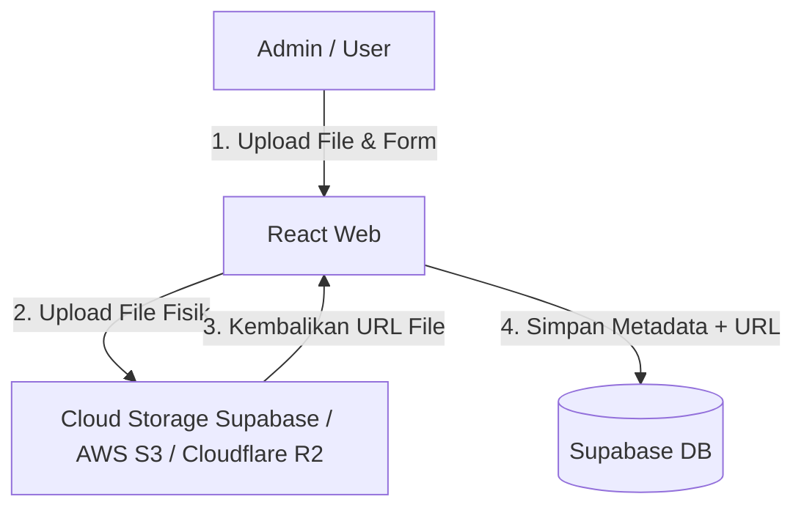

# 📂 Rekomendasi Arsitektur & Fitur Arsip Digital (SIKN/JIKN Lokal)

Dokumen ini berisi analisis teknis dan rekomendasi arsitektur untuk memenuhi permintaan klien mengenai penarikan data dari SIKN/JIKN atau pembuatan fitur unggah arsip mandiri tanpa membebani database.

---

## 1. Validasi Masalah: Menyimpan "Object Digital" di Database

> [!WARNING]
> Analisis Anda **100% benar**. Menyimpan objek digital (seperti scan dokumen sejarah PDF, peta resolusi tinggi, atau foto arsip kuno) secara langsung di dalam database (sebagai data Base64 atau BLOB) adalah **kesalahan arsitektur yang fatal**.
>
> **Dampaknya:**
> * Ukuran database akan membengkak dalam hitungan hari.
> * Biaya sewa database cloud (seperti Supabase DB) akan menjadi sangat mahal.
> * Performa query pencarian akan melambat secara drastis.
> * Proses backup & restore database menjadi sangat berat.

---

## 2. Solusi Arsitektur Terbaik: Pemisahan Data (Separation of Concerns)

Solusi standar industri untuk kearsipan digital adalah **menyimpan Metadata di Database** dan **menyimpan File Fisik di Cloud Storage**.



### Komponen Arsitektur:
1. **Supabase Database (Metadata):** Hanya menyimpan teks terstruktur seperti:
   * Nomor Arsip / Kode Klasifikasi
   * Judul / Nama Arsip
   * Tanggal Penciptaan & Pencipta
   * Deskripsi / Ringkasan Arsip
   * Kategori (Tekstual, Kartografik, Audio-Visual, dsb.)
   * `file_url` (Link teks yang mengarah ke file di Cloud Storage)
2. **Supabase Storage / Cloudflare R2 (Object Digital):** Menyimpan file asli (PDF, JPEG, PNG). Supabase Storage gratis menyediakan kuota **1 GB** (bisa di-upgrade dengan sangat murah dibanding upgrade database).

---

## 3. Analisis Opsi Integrasi SIKN / JIKN

### Opsi A: Sinkronisasi Data JIKN (Purwakarta) via API/OAI-PMH
Jika klien ingin agar data arsip di website otomatis mengambil data yang sudah mereka input di portal JIKN Nasional:
* **Cara Kerja:** Sistem JIKN nasional (biasanya berbasis software kearsipan **AtoM - Access to Memory**) memiliki protokol standar bernama **OAI-PMH** atau REST API. Kita bisa membuat fungsi penarik (*harvester*) terjadwal untuk menyalin metadata tersebut ke database lokal.
* **Kelebihan:** Admin tidak perlu mengunggah ulang dokumen di dua website yang berbeda.
* **Kekurangan:** Infrastruktur JIKN nasional sering kali lambat atau akses API-nya dibatasi/memerlukan izin birokrasi ke ANRI.

### Opsi B: Fitur Portal Arsip Mandiri (SIKN Lokal Purwakarta) - REKOMENDASI TERBAIK
Membuat modul khusus di web Disipusda untuk pencarian arsip sejarah daerah secara mandiri.
* **Cara Kerja:** Admin Disipusda menginput arsip lokal langsung di panel admin, file fisiknya disimpan di Supabase Storage.
* **Fitur yang Masuk Akal & Ringan:**
  1. **Mesin Pencari Metadata:** Pencarian cepat berdasarkan Kata Kunci, Klasifikasi, Tahun, atau Jenis Arsip.
  2. **Watermarking & PDF Viewer:** Agar arsip digital tidak mudah disalahgunakan, file PDF ditampilkan menggunakan PDF viewer yang dikunci (tidak bisa klik kanan / unduh langsung tanpa izin).
  3. **Form Permohonan Akses Arsip:** Untuk arsip yang bersifat rahasia/terbatas, user tidak bisa langsung melihat file digitalnya. Mereka harus mengisi form pengajuan secara online, lalu admin akan memverifikasi dan mengirimkan salinan via Email/WhatsApp.

---

## 4. Langkah Implementasi Fitur Arsip Mandiri (Ringkas & Aman)

Jika Anda ingin mengimplementasikan fitur ini di masa depan, berikut rancangan tabel database-nya:

```sql
-- Tabel Metadata Arsip
CREATE TABLE data_arsip (
    id UUID DEFAULT gen_random_uuid() PRIMARY KEY,
    nomor_arsip VARCHAR(100) UNIQUE NOT NULL,
    judul VARCHAR(255) NOT NULL,
    deskripsi TEXT,
    pencipta VARCHAR(150),
    tanggal_penciptaan DATE,
    kategori_arsip VARCHAR(100), -- contoh: 'Surat Keputusan', 'Foto', 'Peta'
    file_url VARCHAR(255), -- Link ke Supabase Storage
    is_public BOOLEAN DEFAULT true,
    created_at TIMESTAMP WITH TIME ZONE DEFAULT timezone('utc'::text, now()) NOT NULL
);
```

### Kebijakan Pembatasan File (*Upload Capping*):
- Terapkan batas maksimum file (misal: maksimal 15MB per file PDF).
- Berikan edukasi ke admin/klien untuk mengompres file scan terlebih dahulu (misal menggunakan tools PDF compressor) sebelum diunggah ke website.
